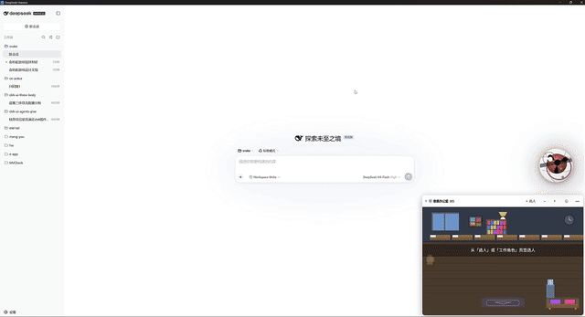
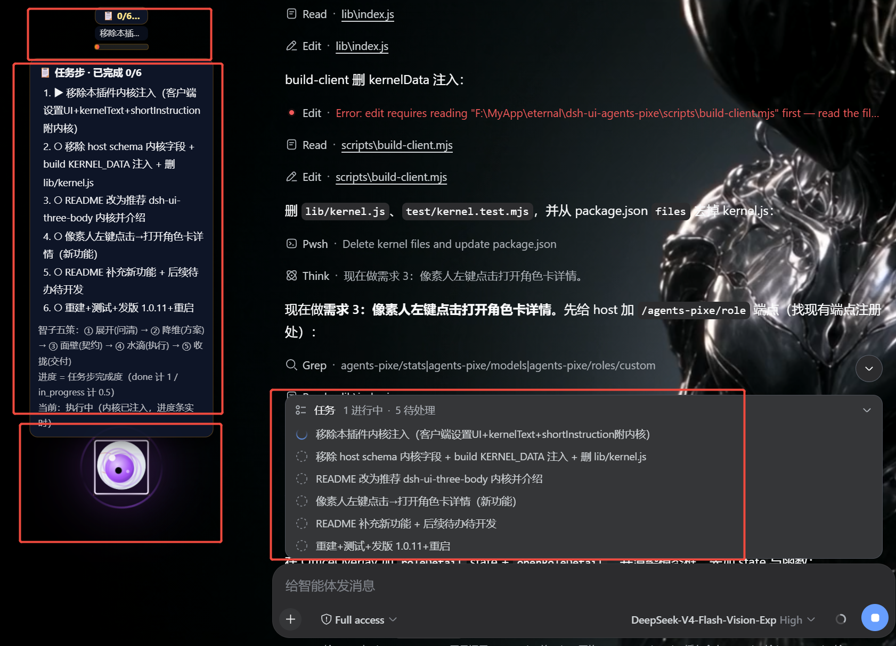
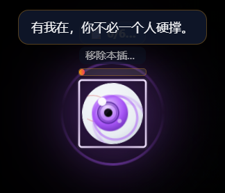

# 三体智子（dsh-ui-three-body）

> 🔥 **给 DeepSeek Harness 装上「会验收的产品设计 copilot — 智子」**：把一句话人话逼成一份**可评审、可执行、可落地、可验收**的产品方案，并且**不过闸不交付**。需求剖析 → UI 定版 → 规范方案 → 契约审核 → 实时进度 → 验证交付，全闭环；悬浮一颗会眨眼、会东张西望、会闪现的智子，11 款动态皮肤。**一条命令安装，不改 dsh 源码。**

---

<p align="center">
  
  <br/>
  <em>智子悬浮演示：原色人眼 / 写轮眼 / 万花筒 / 轮回眼 / 三体智子等 11 款皮肤，瞳孔旋转 + 幽灵闪现</em>
</p>

<p align="center">
  
  <br/>
  <em>智子核心：悬停智子展开「目标显示」——头顶进度 + <strong>智子五策</strong>（展开→降维→面壁→水滴→收拢），任务步列表实时同步</em>
</p>

<p align="center">
  
  <br/>
  <em>智子暖心对话：紫色智子 + 安抚气泡「有我在，你不必一个人硬撑。」，头顶进度条显示目标标题</em>
</p>

---

## 💔 大多数 agent 用户的痛 → 智子怎么解

> 用 agent 产品的头号挫败，不是"模型不够聪明"，而是**没流程、没验收、没准头**。下面是普遍痛点与智子的解法（Before → After）。

| 痛点（绝大多数 agent 用户的体验） | 智子解法（对比） |
|---|---|
| **需求理解错，写一半才发现返工** | **第一性原理 + 一次问清**：先问「为什么」，把一句话拆成 5 个可核事实，绝不脑补、绝不挤牙膏 |
| **AI 上来就写代码，方案长啥样都看不见** | **UI 交付前置定版**：GUI/Web/手机端，给方案前先三选一（4 样板 / 1 样板 / 仅 markdown），**点 HTML 定版**而不是看文字想象 |
| **输出格式漂移，无法复用** | **契约结构化**：目标/分步/验收/风险输出成**可解析对象** + **产物模板**（架构/流程/拓扑图，按 dsh-theme） |
| **过度工程，写了一堆不该写的** | **按规模路由（S/M/L）**：小改动走**最懒原则（YAGNI）**、大项目才全量上强度——**该省则省、该花则花** |
| **AI 说"完成了"，但不知道对不对** | **可执行验收 + 验证环 + 自评达标闸**：验收=**可运行断言**，交付前**真实跑过**测试/构建，**不过闸不交付** |
| **token 白烧，聊着聊着就贵** | **AI 模式 = token 总闸**（关=每轮零 token）；按规模花 token，长任务**头顶进度 + 短标题**可视 |
| **小改动也走大流程，很烦** | **S/M/L 自适应**：小任务零打扰、中任务一次准/驳、大任务多次评审——**流程跟着任务大小走** |

---

## 🧠 内核设计：借鉴了哪些热门 star 项目（权威背书）

> 智子的内核不是自说自话，而是**吸收了当前主流 agent 工程的方法论**——每一层都有出处。

| 借鉴项目 | Star(约) | 智子借了它的什么 |
| --- | --- | --- |
| [**ponytail**](https://github.com/DietrichGebert/ponytail) | ~5k+ | **最懒资深工程师**：YAGNI、stdlib 优先、不加未请求抽象 → 用于 **S 档小任务**，只写该写的 |
| [**obra/superpowers**](https://github.com/obra/superpowers) | ~30k+ | **计划→实现→测试**的工程方法论 skills → 用于 **M 档**：先过审再动手（契约准/驳） |
| [**LangGraph**](https://github.com/langchain-ai/langgraph) | ~15k+ | **图式状态机/编排**（可循环/分支/重试/持久化）→ 用于 **L 档大项目**，长任务可控可断点 |
| [**DSPy**](https://github.com/stanfordnlp/dspy) | ~22k | **声明式 + 自动优化 + benchmark 驱动** → 用于 **L 档**，方案可量化迭代 |
| [**Instructor / Outlines**](https://github.com/567-labs/instructor) | ~10k / ~13k | **结构化输出 / 受约束解码**（Pydantic / 语法约束）→ 契约与产物**可解析**，格式零漂移 |
| [**promptfoo / DeepEval**](https://github.com/promptfoo/promptfoo) | ~8k / ~6k | **评估/回归**（产出打分）→ 把「不写空话」变**真可测**，**达标才交付** |
| [**OpenHands**](https://github.com/All-Hands-AI/OpenHands) | ~45k | **自主执行**（写码/跑测/提 PR）→ 用于 **L 档**，真干活而非空谈 |
| **T-shirt sizing**（PM/工程通用） | — | **按规模定策略**（S/M/L）→ 智子的**三问定档**，流程跟着任务大小走 |

> star 为近期趋势**约值**，以各自仓库为准。

---

## 🎯 智子五策 + 质量闸（内核全貌）

**内核 = 三铁律 + 智子五策 + 规模路由 + 质量闸。** 不是一条规则，是一条**验证驱动的交付流水线**：

```
用户说「做 X」
   │
   ▼
[展开·问清]  第一性原理拆 5 事实 + 三问定档(S/M/L)
   ▼
[降维·方案]  UI 前置三选一   →  思路/取舍/一句话目标   →  产物模板(架构/流程/拓扑)
   ▼
[面壁·契约]  目标→分步→验收→风险   →  ask_user_question「准/驳」→ 改只改差异
   ▼
[水滴·执行]  create_goal + todo_write   →  分阶段评审   →  (L)编排/状态机
   ▼
[收拢·交付]  /* 质量闸：不过闸不交付 */
             ① 真验证环( lint / test / build / run 全过 )
             ② 验收 = 可执行断言(实跑)
             ③ 自评达标(有 benchmark 才启用 · 阈值≥ )
             ④ 人审 + 可回滚 + 契约外停手
   ▼
交付 = 复命 + 验证证据(实际执行输出)
```

| 质量闸 | S 小 | M 中 | L 大 |
|---|---|---|---|
| ① 真验证环 | 改完能跑/无回归，关键路径过 lint | 新增/改动模块**必须带测试且跑过** | **CI 级**：lint+typecheck+test+build+run 全过才收拢 |
| ② 验收=可执行断言 | "能跑/无回归" | 每项给**可跑命令/断言** | 每项一条**可执行断言**，实跑 |
| ③ 自评达标闸 | 无 | 关键路径单项达标 | 有评估集才启用；**≥阈值否则回「水滴」重修** |
| ④ 人审 + 回滚 | 自检 | 一次准/驳 | 多次评审 + 可回滚 |
| ⑤ 模型能力 | 任意 | 任意 | 优先 reasoning 强模型；无则**人工加审** |

> **诚实边界**：质量闸由 agent 按协议执行（内核是行为指令，非系统强制 CI），但设为**不可跳过步骤** = 从「可选」升级为「必须执行」。这补上的是**验证**这一最大缺口；剩余不确定性来自**模型能力上限**与**你对需求的描述**——任何方案都无法 guaranteed。

---

## ✨ 亮点速览（为什么值得装）

| 亮点 | 说明 |
| --- | --- |
| 🧠 **AI 真正开智** | 每次对话注入「智子内核」——第一性原理 + **智子五策**（展开·问清→降维·方案→面壁·契约→水滴·执行→收拢·交付），一次问清、一次定稿、绝不反复问 |
| 🎨 **UI 交付前置询问** | 凡涉 GUI/Web/手机端，给方案前必先三选一定版：每套 UI **4 样板** / **1 样板** / **仅 markdown**（开发架构+生产流程+拓扑图，规范参考 dsh-theme），一次问清、定版后不再打扰 |
| 🎭 **方案呈现规范** | 章程先声明交付形态：GUI/Web **优先附 HTML 样板** + 设计 token + 组件清单；先定风格方向 + 审美锚点，让审核看得见、开发不抓瞎 |
| 🚫 **反 AI 味设计** | 套真实 design token（`--dsw-alias-*`），避免居中对称、卡片矩阵、emoji 泛滥等模板化 AI 感布局——出的是作品，不是模版 |
| 📊 **规模路由 + 质量闸** | 按 S/M/L 自适应深度；验收=可执行断言、真实验证环、不过闸不交付 |
| 🎭 **11 款动态皮肤** | 原色（人眼）、深渊、宇宙死瞳、**写轮眼、万花筒、轮回眼、三体智子**、白眼、血瞳、尸瞳、魔瞳——瞳孔旋转/脉冲、血雾、灰烬、火舌全动态 |
| 👻 **幽灵模式** | 鼠标静止 n 秒 → **100% 闪现到随机点位**（远离原地）；东张西望 / 原地休息可配置 |
| 🗣 **暖心对话** | 每隔 5-10 秒随机说一句安抚的话（"别急，主上，慢慢来"等，可关）；不再用恐怖台词骚扰 |
| 🔒 **零消耗保证** | **AI 模式 = token 总闸**（默认开）；关闭 AI 模式 = 智子纯装饰、每轮零 token（实测铁证）；休眠仅暂停活动 |
| ⚙️ **一键直达** | 悬浮浮层 ⚙️ 直达「设置 → 三体」；菜单一键 /tame、需求剖析、填输入框（新会话也能填） |
| 📊 **头顶进度条** | 头顶常驻「进度 + 短标题」（目标只显示进度与简短标题，不刷全文），悬浮/点击展开完整步骤列表——进度一眼可见 |

**适合**：想让 AI 更听话的打工人 / 喜欢恐怖萌宠的桌面党 / 三体与火影双厨 / 在意 token 成本的效率党 / 对"AI 交付质量"不放心的人。

---

## 🚀 安装

```bash
# 已发布后（npm）
dsh plugin --profile web add dsh-ui-three-body

# 从 GitHub
dsh plugin --profile web add github:EternalNight996/dsh-ui-three-body

# 本地联调（link 本地目录，改代码即时生效）
dsh plugin --profile web add F:/MyApp/eternal/dsh-ui-three-body
```

> 💡 推荐搭配 [**dsh-desktop**](https://github.com/EternalNight996/dsh-desktop)（DeepSeek Harness 桌面壳）使用，桌面版上智子视觉与性能体验最佳。

装完**重启 dsh web**：悬浮智子出现在屏幕右侧（右留 96px），点击弹菜单、长按拖拽。

---

## 🎭 悬浮智子

- **11 款皮肤**（设置 → 三体 或 菜单循环切换）：
  原色（真实人眼黑瞳）/ 深渊 / 宇宙死瞳 / **写轮眼（三勾玉旋转）/ 万花筒 / 轮回眼（波纹脉冲）/ 三体智子（六边形质子旋转）** / 白眼（放射纹旋转）/ 血瞳 / 尸瞳 / 魔瞳
- **动态层**：瞳孔动画 + 光晕脉冲 + 冲击波 + 皮肤特效（血雾/灰烬/火舌/幽灵光带/雷霆/毒泡/星点）
- **行为**：随机眨眼、眼睛跟随鼠标（命令式 GPU 合成，零 re-render）、东张西望（rAF 丝滑，不受鼠标控制）
- **幽灵模式**：鼠标静止 n 秒（3-60s 可调）→ **100% 闪现**到远离原位的随机点；东张西望/原地休息可配置开关
- **暖心对话**：每隔 5-10 秒随机说一句安抚的话（可随开关关闭）
- **目标显示**：头顶常驻「进度 + 短标题」，悬浮/点击展开完整步骤列表（可开关）

## 🧠 内核（开智内容）

`lib/kernel.js`，三档 × 双语：

| 档位 | token/轮 | 说明 |
| --- | --- | --- |
| `minimal` | ~120 | 一键五策骨 |
| `balanced`（默认） | ~400 | 三铁律 + **智子五策**（展开·问清→降维·方案→面壁·契约→水滴·执行→收拢·交付） |
| `full` | ~500 | balanced + 官网示例 |

人设可配：语气（傲慢/温和/热忱）、自称（本尊）、称呼（主上）——**首次唤醒弹窗**定规矩。

## 🔒 Token 管控

| 设置 | 语义 | 默认 |
| --- | --- | --- |
| **智子活动（内核开智）** | 不休眠 | 开 |
| **AI 模式** | **token 总闸**：决定是否注入内核 | **开** |
| 休眠（菜单/悬浮点击） | 完全暂停 | - |

- **AI 模式关 = 每轮零智子 token**（实测：内核段不在 prompt、无工具、无 LLM 调用）
- 休眠 = 暂停活动（不注入 + 智子休眠态）
- `beast_analyze` 剖析工具默认关（每次调用多一次模型请求）

## ⚙️ 设置 → 三体

悬浮智子 → 菜单 → ⚙️ 三体设置（或 设置 → 三体）：

- 智子活动（内核开智）+ AI 模式
- 悬浮智子开关、尺寸（极微/微/小/中/大）
- 皮肤（11 款分段选择）
- 幽灵模式：开关、间隔秒数、东张西望、闪现
- 目标显示（进度 + 短标题）
- 暖心对话（每隔 5-10 秒安抚的话）
- 内核档位 / 语言 / 语气 / 自称 / 称呼你
- 需求剖析工具 / 内核覆盖（自定义内核文本）

## 🛠 开发 / 构建

```bash
pnpm i
pnpm build        # 只改 client（src/client）时需要
# 改 index.js / lib/kernel.js 无需构建，重启即生效
```

## 📁 目录结构

```
dsh-ui-three-body/
├── index.js              # host 插件：内核注入 + settings 命名空间（无构建，即装即用）
├── lib/
│   ├── kernel.js         # 智子内核文案（minimal/balanced/full × zh/en × 语气）
│   └── client.js         # client bundle（构建产物，__ModuleLoader__ 格式）
├── src/
│   └── client/index.tsx  # client 源码：悬浮智子 + 皮肤系统 + 幽灵模式 + 设置分区
├── assets/
│   └── screen/           # README 演示素材（sophon-demo.gif / sophon-preview.png）
├── cordis.patch.yml      # bundle 补丁层（host 行，安装自动挂载）
├── build.mjs             # esbuild 构建脚本（TSX → lib/client.js）
├── package.json          # bundle/client 清单（dsh.bundle.patch + dsh.client）
└── README.md
```

## 🗺 待办 / 路线图（功能性优先）

- [x] **目标显示开关 + 进度 + 短标题**：头顶只显示进度与简短标题，完整目标悬浮展开（可开关）
- [x] **暖心对话**：移除恐怖台词，改每隔 5-10 秒随机安抚话（可开关）
- [x] **皮肤炫光升级**：非原色主题加旋转能量环 + 双层脉冲强光
- [x] **skill-catalog 瘦身**：`~/.agents/skills` 110→51，目录体量下降

> 后续开发**倾向功能性**：把智子做成「按规模自适应、产物可解析、验收可测」的自主交付系统（记忆相关交由 dsh-memory-eternal）。

- [ ] **规模路由（三问定档）**：智子展开加一问规模(S/M/L)，按档位选五策深度 + 质量闸，边做边升/降档
- [ ] **契约结构化**：用 Instructor 式把「目标/分步/验收/风险」输出成可解析对象
- [ ] **验收可测**：验收=**可执行断言**；L 级接 promptfoo/DeepEval 钩子，达标才交付
- [ ] **token 计价可视化**：头顶显示本轮上下文/历史占比，让省在哪看得见
- [ ] **五策按需 skill 化**：把五策拆成可独立加载的 skill，小任务不拉整套
- [ ] **skill-catalog 按需/精简开关**：dsh 侧「全目录 → 按需/精简」，开关放进智子设置
- [ ] **产物模板规范化**：四节 markdown（架构/流程/拓扑图）模板化，按 dsh-theme 规范
- [ ] **可度量 benchmark**：五策 vs 无内核做小样本对比（质量/轮次/token）量化收益

## 📦 本次改善记录（v0.2）

- **皮肤系统大改**：精选 11 款（去冗余），瞳孔动画（写轮眼勾玉旋转、轮回眼波纹脉冲、智子六边形旋转、白眼放射纹），光晕脉冲 + 冲击波 + 皮肤特效
- **幽灵模式**：闪现 100%（远离原位随机点）、东张西望（rAF 丝滑、不受鼠标控制）、原地休息，三个动作由开关管控
- **AI 模式新增**：token 总闸，与休眠区分；**休眠/AI 关 = 每轮零 token（实测）**
- **暖心对话**：移除反人类台词，改每隔 5-10 秒随机安抚话
- **设置 → 三体顶层分区** + 浮层 ⚙️ 一键直达
- **菜单命令**：/tame、需求剖析，**新会话也能填入输入框**
- **目标显示**：头顶「进度 + 短标题」，悬浮展开完整步骤列表
- **渲染性能**：眼珠跟随改命令式 transform（translate3d + GPU 合成）、缓存视口尺寸防 layout thrash、prefers-reduced-motion 支持
- **背景透明**：方框背景全透明，只留眼球本体；雾气由方框向外散发（非原色皮肤）

## 📄 License

MIT

---

> 三体人递给你一颗质子：「你的 AI，该开智了。」👁️
