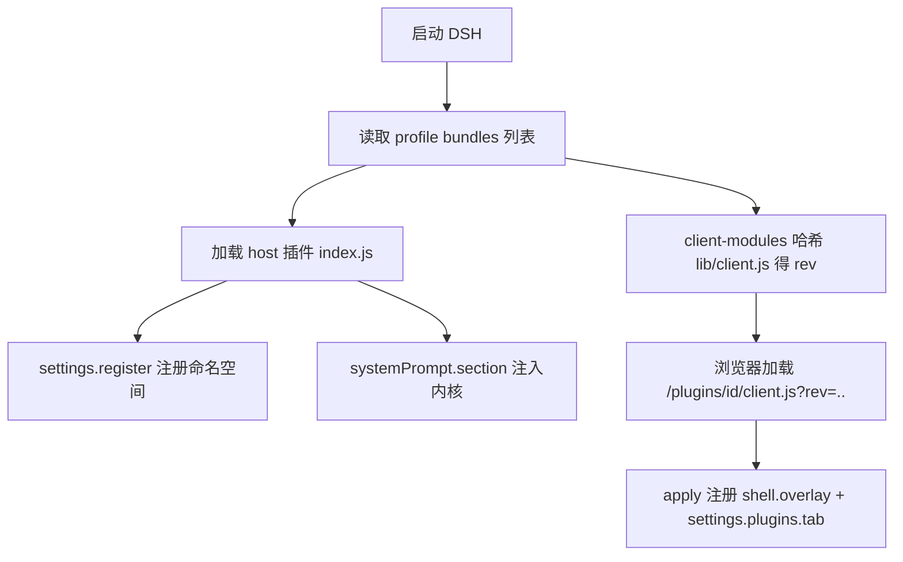
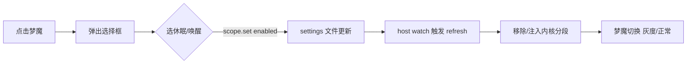
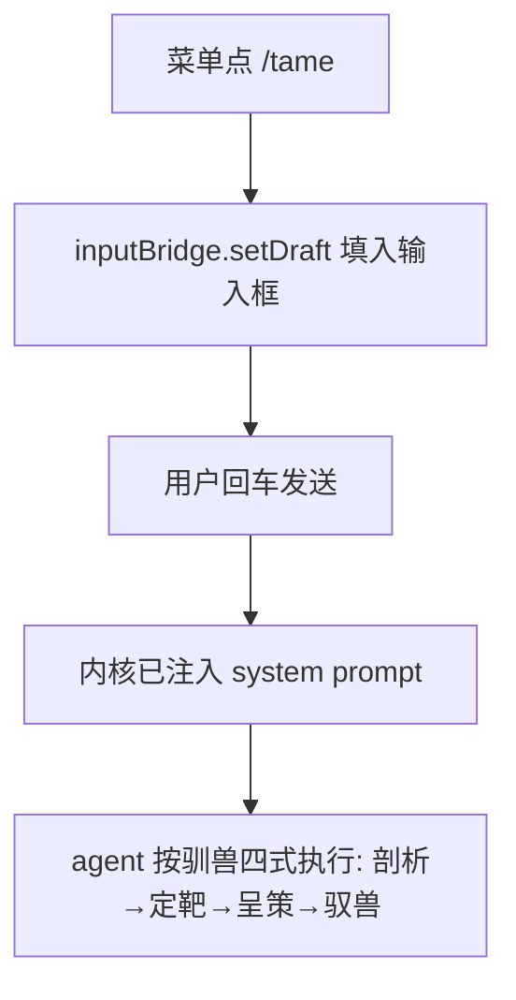
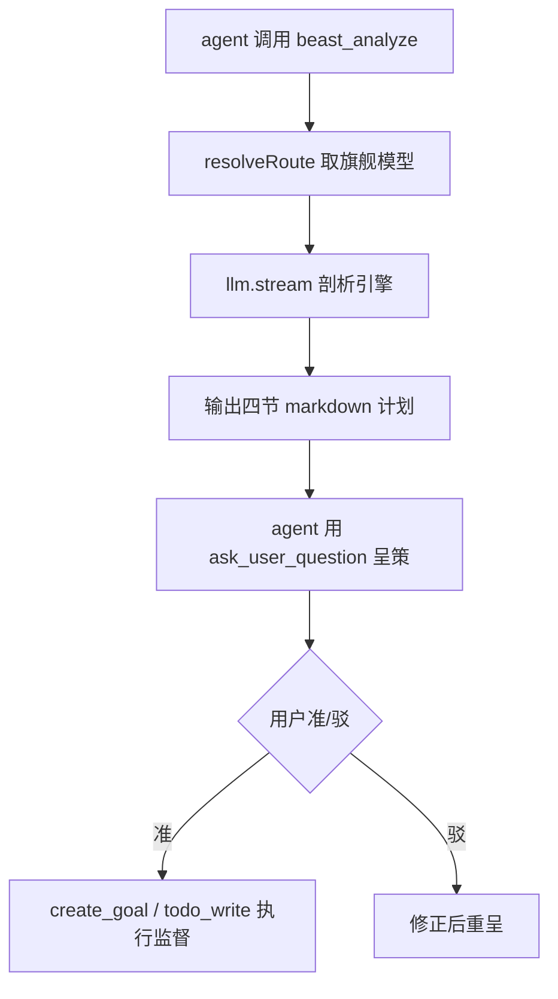

# 梦魔（驯兽场）· 底层原理与交互方式

> 功能验证文档：把「梦魔」插件的**底层原理**与**交互方式**用思维导图 + 流程图讲清。
> 读完能回答三件事：内核怎么注入、设置怎么持久化、悬浮梦魔怎么交互。

---

## 一、总览（思维导图）

```
dsh-ui-three-body（梦魔 / 驯兽场）
│
├─ Host 侧（Node 进程，index.js）
│   ├─ settings.register('beast-tamer')   ← 持久化设置命名空间
│   ├─ systemPrompt.section('beast-tamer:kernel')  ← 注入「梦魔内核」
│   └─ beast_analyze 工具（可选）          ← 需求剖析 → markdown 计划
│
├─ Client 侧（浏览器，src/client/index.tsx → lib/client.js）
│   ├─ shell.overlay → 悬浮梦魔（点击/拖拽/情绪态）
│   ├─ settings.plugins.tab → 「驯兽场」设置页
│   ├─ shell.overlay → 首次唤醒弹窗
│   └─ conversation.composer.dock → 输入框桥接（/tame 快捷填入）
│
└─ 资产
    ├─ lib/kernel.js   ← 内核文案（minimal/balanced/full × zh/en）
    ├─ build.mjs       ← esbuild 打包 TSX → __ModuleLoader__ 格式
    └─ cordis.patch.yml ← 默认配置补丁（enabled/mode/petEnabled）
```

---

## 二、底层原理

### 1. 内核如何注入（核心资产）

内核不是「改模型」，而是往**每次请求的 system prompt 里插一段分段**。

```
设置变化 / 启动
   │
   ▼
resolveText(cfg) ──► kernelOverride（优先）或 kernelForMode(mode, lang, persona)
   │                          │
   │                          └─ 把 {{self}}/{{master}} 替换成自称/称呼
   ▼
ctx.systemPrompt.section({ name:'beast-tamer:kernel', order:5, text })
   │
   ▼
组装进 system prompt（任何模型、任何会话都生效）
```

- `enabled=false` → `dispose()` 移除分段，0 额外 token。
- 档位 `minimal/balanced/full` 控制注入文案长短（token 成本）。
- **联动当前模型是自动的**：内核只是 prompt 的一个分段，与模型无关。

### 2. 设置如何持久化

```
host:  ctx.settings.register('beast-tamer', Config, { base })
        ↓ 写入 ~/.dsh/settings.yaml 的 beast-tamer 命名空间
client: ctx.settingsScope.bind({ namespace:'beast-tamer' })
        ↓ scope.getSnapshot() / scope.set(field, value) 读写
        ↓ 变化经 connection 推送，host 热更新内核分段
```

关键点：设置存**settings 文件**（不是 localStorage）；`petPos`（悬浮位置）也持久化。

### 3. 需求剖析工具 beast_analyze（可选）

设置页开启后，host 注册工具 `beast_analyze`：

```
beast_analyze({ requirement, context })
   → resolveRoute(llm)：取第一个 provider 的旗舰模型
   → llm.stream(...)：以「剖析引擎」system prompt 生成四节 markdown
   → 返回「需求剖析 / 目标 / 分步计划 / 验收标准」
```

与内核同样复用**已配模型**，`reasoningEffort:off + maxTokens:1200` 控成本。

### 4. 悬浮梦魔的渲染

```
ctx.slots.inject('shell.overlay') → BeastPet
   ├─ useScope(scope)     ← 读设置（enabled/petEnabled/petPos）
   ├─ useRunning(sessions)← 当前会话是否 running（驱动情绪态）
   └─ 情绪态：sleep（关）/ idle（开）/ work（会话运行中）
        └─ 驱动呼吸频率、披风摆动、发光眼亮度、灰度
```

---

## 三、交互方式

### 悬浮梦魔（BeastPet）

| 操作 | 回应 |
| --- | --- |
| **悬浮（hover）** | 背景变金 `rgba(245,158,11,.20)` + 描边光环 + 放大 1.04 |
| **快速点按** | 弹出选择框（/tame · 驯兽场设置 · 休眠/唤醒）+ 点击缩放 + 扩散光环动画 |
| **长按 280ms 后拖** | 移动位置，松手持久化 `petPos` |
| **随机眨眼 / 眼睛跟鼠标** | 活物感（发光眼瞳孔随光标偏移，休眠时闭眼） |
| **会话运行中** | 呼吸加快、披风摆快、发光眼更亮（工作态） |

### 选择框（点击弹出）

```
点击梦魔
   ├─ /tame            → 输入框填入 "/tame "（触发驯兽四式）
   ├─ 驯兽场设置       → 尽力打开 设置 → 插件 → 驯兽场
   └─ 休眠 / 唤醒       → 开关 enabled（内核注入）
```

### 设置页（设置 → 插件 → 驯兽场）

总开关 · 悬浮梦魔开关 · 内核档位 · 语言 · 语气 · 自称/称呼 · 剖析工具 · 内核覆盖。

---

## 四、流程图

### ① 启动装载



### ② 点击开关内核



### ③ /tame 命令



### ④ beast_analyze（开启后）



---

## 五、功能性验证清单

| 功能 | 验证方式 | 预期 |
| --- | --- | --- |
| 内核注入 | 任意会话问「你是谁」 | 回答含梦魔人设（本尊/主上） |
| 开关内核 | 菜单点休眠 | 梦魔变灰；再点唤醒恢复 |
| 悬浮变色 | 鼠标悬停梦魔 | 背景变金 + 光环 + 放大 |
| 点击回应 | 快速点按 | 弹出选择框 + 缩放 + 扩散光环 |
| 拖拽持久化 | 长按拖动后刷新 | 位置保持（petPos） |
| 设置页 | 设置 → 插件 → 驯兽场 | 可见并可改各字段 |
| 剖析工具 | 开启 analyzeTool 后发需求 | 产出四节 markdown 计划 |
| 最右居中 | 删除 petPos 后刷新 | 梦魔贴右侧、垂直居中 |
